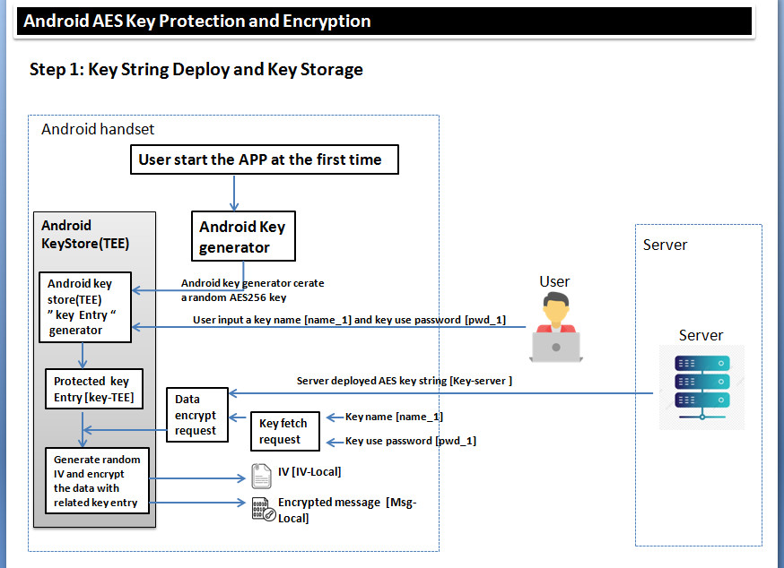
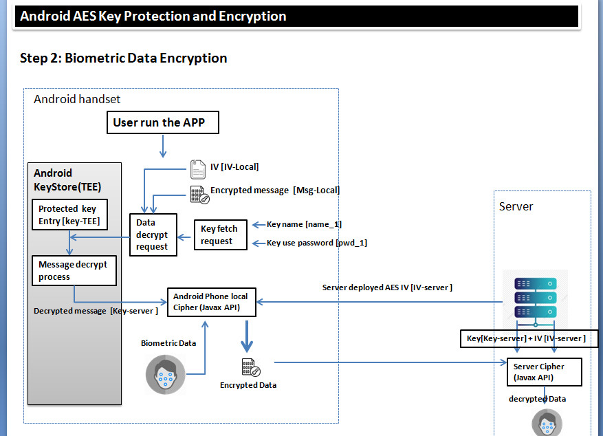

# Android_KeyStore_Data_Protection
#### Introduction

This project will create a Android App to use Android KeyStore to protect some security biometric data. 

We follow these project to implement our program: 

https://gist.github.com/JosiasSena/3bf4ca59777f7dedcaf41a495d96d984

https://medium.com/@josiassena/using-the-android-keystore-system-to-store-sensitive-information-3a56175a454b

https://medium.com/@hakkitoklu/aes256-encryption-decryption-in-android-2fae6938fc2b

https://github.com/hakkitoklu/AESencryption

The program implementation contains two sections: 

**Server AES256 Key String Deploy and Key Storage** : In this section, we try to use the Android KeyStore API to protect the data encryption key deployed by the server. 

In this section the program will follow below steps to work: 

1. When the user has installed the APP and started the APP at the first time , we will use Android key generator to create a random AES 256 key(we call it **key_1**). 
2. We let the user generate a key name (**name_1**) and a key protection password(**pwd_1**). 
3. The Android KeyStore[Tee] will create a protected "key entry" base on **key_1**, **name_1** and **pwd_1**.(When we are using Android keyStore TEE API, if the key name or password is incorrect we can not call any function in the keyStore API. At the same time the key in KeyEntry is not extractable by any program running under android system's normal world )
4. The Server send the AES256 key string[**Key-server**] which needs Android KeyStore to protect to the phone/APP. 
5. We pass the [**key-server**], [**name_1**], [**pwd_1**] into the Android KeyStore [TEE] as a data encryption request. 
6. The [**key-server**] will be encrypted by the Android KeyStore KeyEntry's Key[**Key-Tee**] and the created encrypted message is [**Msg-local**]. The Android KeyStore will also return the randomly generated IV which used to encrypt the [**key-server**]. 
7. So in the phone the [**key-server**] will not be saved, we only save the random IV[**IV-local**] and the encrypted message[**Msg-local**] in the Android system normal world.

**Biometric Data Encryption** : In this section, we try to try to recover the server deployed key from Android KeyStore and use it to encrypt the biometric data. 

In this section the program will follow below steps to work: 

1. When we want to encrypt the biometric data, we create a data decryption request with correct key name[**name_1**] and password[**pwd_1**] . 
2. We passed the pre-saved IV [**IV-local**] and encrypted message [**Msg-local**] from section one into the Android KeyStore for decryption. 
3. The KeyStore TEE will retrieve the [**key-sever**] and pass it back to the Cipher object in normal world. 
4. The Java cipher object running in the Android phone normal world will accept another IV[**IV-server**] from the server side, then encrypt the biometric data with [**key-serve**r] and [**IV-server**]. 
5. The App will send the encrypted biometric data back to server and at the sever side we can use [Key-server] and [IV-server] to recover the biometric data. 

------

#### 2. Program Setup

###### Development Environment: 

> android studio v3.6

###### Additional Lib Need

> None

###### Hardware Need

> None

------

#### 3. System Design

------

#### 4. Program Usage

------

> Last edit by LiuYuancheng(liu_yuan_cheng@hotmail.com) at 28/05/2020

